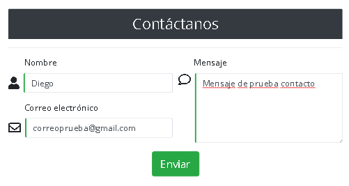

# Desplegar un sitio web en Firebase como hosting

**Firebase Hosting** nos brinda una manera rápida, segura y confiable para alojar los elementos estáticos de tu app con HTML, CSS, JavaScript, y más, además de entregar contenido dinámico y alojar microservicios.

- [Desplegar un sitio web en Firebase como hosting](#desplegar-un-sitio-web-en-firebase-como-hosting)    
- [Crear un proyecto en la consola de Firebase](#crear-un-proyecto-en-la-consola-de-firebase)    
- [Instalar Firebase CLI e iniciar el proyecto](#instalar-firebase-cli-e-iniciar-el-proyecto)
- [Configuración de las variables de entorno](#configuración-de-las-variables-de-entorno)
- [Implementar tu sitio](#implementar-tu-sitio)
- [servidor local](#servidor-local)    
- [Enviar correo a tu cuenta usando Nodemailer](#enviar-correo-a-tu-cuenta-usando-nodemailer)
- [Prerequisitos](#prerequisitos)
- [Implementación del servidor](#implementación-del-servidor)
- [Variables de entorno](#variables-de-entorno)
- [Ejecutar el servidor](#ejecutar-el-servidor)
- [Implementación de la conectividad](#implementación-de-la-conectividad)
- [Simulación](#simulación)

## Crear un proyecto en la consola de Firebase

1. Ir al [sitio web de Firebase](https://firebase.google.com/docs/web/setup?hl=es). Ingresar con tu cuenta de google.
2. Hacer clik en `Agregar proyecto`.
3. Agregar un nombre.

<p align="center">
    
</P>

4. Si deseas puedes activar Google Analytics.

<p align="center">
    
</P>

5. Si has habilitado, coloca un nombre para la cuenta de Google Analytics.
6. Click en crear proyecto.

<p align="center">
    
</P>

## Instalar Firebase CLI e iniciar el proyecto

Se debe instalar `Node.js` esto instalará automáticamente las herramientas de `npm`. Firebase CLI requiere Node.js 8.0.0 o versiones posteriores.

1. Ejecutar el comando para instalar Firebase CLI con npm:

```console
npm install -g firebase-tools
```
<p align="center">
    
</P>

La opción `-g` habilita el comando firebase disponible de manera global.

2. Inicia sesión con tu cuenta de firebase.

```console
firebase login
```
3. Luego respondemos con _si_, **Y**, se nos abrirá una ventana donde tenemos que seleccionar nuestra cuenta de google que contiene el proyecto de Firebase creado.

4. Dar click en **Permitir**.

5. Inicia tu proyecto.

```console
firebase init
```

6. Seleccionar con la barra espaciadora las carácterísticas que tendrá nuestro proyecto. Si solo deseas el servicio de hosting selecciona este y continua con el proceso. En caso de seleccionar otras funciones para la nube debes seleccionar en tu proyecto una ubicación para el funcionamiento de estos.

7. Selccionar `Use an existing proyect`.

<p align="center">
    
</P>

* Puedes especificar el directorio raíz público ahora o más tarde en el archivo de configuración `firebase.json`.
* Si aún no tienes un archivo `index.html` Firebase los crea para ti.
  
Al final de la inicialización, Firebase crea y agrega automáticamente dos archivos a la raíz del directorio de la app local:

* Un archivo de configuración `firebase.json` que enumera la configuración del proyecto. 
* Un archivo `.firebaserc` en el que se almacenan los alias del proyecto.


### Configuración de las variables de entorno

A menudo, necesitarás una configuración adicional para tus funciones, como claves de API de terceros o una configuración ajustable. El SDK de Firebase para Cloud Functions ofrece una configuración de entorno integrada para facilitar el almacenamiento y la recuperación de este tipo de datos para tu proyecto.

Para almacenar los datos del entorno, puedes usar el comando `firebase functions:config:set` en Firebase CLI.

Por ejemplo, para almacenar el ID de cliente y la clave de API de "Servicios", podrías ejecutar lo siguiente:

```console
firebase functions:config:set servicios.key="THE API KEY" servicios.id="THE CLIENT ID"

```

1. Generamos nuestras claves.

```console
firebase functions:config:set service.apimail_pass="THE API KEY" service.apimail_user="THE CLIENT ID"

```

2. Verificar que se almacena actualmente en la configuración de entorno de tu proyecto. Puedes usar `firebase functions:config:get`. Usamos el comando:

```console
firebase functions:config:get
```

Observamos como resultado un json similiar a:

```json
{
  "service": {
    "apimail_user": ""THE CLIENT ID,
    "apimail_pass": ""THE API KEY"
  }
}
```

3. Puedes guardar en un archivo las variables con el comando:

```console
firebase functions:config:get > env.json
```
Sin embargo, no es necesario tenerlo deberías borrarlo.


4. Ahora modificamos la función que hace uso de estas variables de entorno.

Parte de la configuración se proporciona de forma automática bajo el espacio de nombres firebase reservado. La configuración del entorno está disponible dentro de la función en ejecución a través de `functions.config()`.

Pasamos de esto:

```javascript
 let transporter = nodemailer.createTransport({
        host: "smtp.gmail.com",
        port: 587,
        secure: false, // true for 465, false for other ports
        auth: {
        user: process.env.EMAIL,
        pass: process.env.PASSWORD
        }
    });
```

A esto:

```javascript
let transporter = nodemailer.createTransport({
    host: "smtp.gmail.com",
    port: 587,
    secure: false, // true for 465, false for other ports
    auth: {
    user: functions.config().service.apimail_user,
    pass: functions.config().service.apimail_pass
    }
});
```


## Implementar tu sitio

1. Para realizar implementaciones en tu sitio, ejecuta:

```
firebase deploy
```

Con esto, se implementa una actualización en los sitios de Hosting predeterminados de tu proyecto de Firebase:

* projectID.web.app
* projectID.firebaseapp.com

2. Luego de desplegar el proyecto, podremos ver en nuestro proyecto de firebase el nombre de nuestro dominio desplegado. Hacemos click en la dirección URL de nuestro dominio. 

<p align="center">
    
</P>

3. En la sección de Functions de nuestro proyecto podemos ver el enlace que debemos usar para hacer las peticiones. Sería similar a este formato:

```console
https://us-central1-NOMBRE_DE_TU_PROYECTO.cloudfunctions.net/app 
```

<p align="center">
    
</P>

4. Enviamos los datos usando primero el programa Postman.

<p align="center">
    
</P>

5. Verificamos que se ha enviado correctamente.

<p align="center">
    
</P>


6. Enviamos usando la aplicación web.


<p align="center">
    
</P>


7. Verificamos en firebase.

<p align="center">
    
</P>

8. Verificamos en la bandeja del correo.

<p align="center">
    
</P>

Ha llegado correctamente el correo.


Nota: Si queremos cambiar de proyecto usamos el siguiente comando:


```console
firebase use <Id_proyecto>
```


### servidor local


## Enviar correo a tu cuenta usando Nodemailer

Usaremos una cuenta de gmail y el módulo [Nodemailer](https://nodemailer.com/about/) de `Node.js`.

### Prerequisitos

- Nodejs instalado
- Desabilitar las [características de Gmail](https://myaccount.google.com/lesssecureapps) (permitir el acceso a app menos seguras).

 <p align="center">
    
</P>

Asegurate de tener desabilitado la autenticación de dos factores, podrías desabilitar temporalmente o usar otra cuenta de Gmail que no tiene habilitado.

### Implementación del servidor

En otro proyecto diferente al proyecto de angular crearemos el servidor Backend de email.

1. Creamos otra carpeta fuera de todo el proyecto del cliente. Dentro de este iniciamos un nuevo proyecto de Node.

```console
npm init -y
```
Esto creará un archivo `package.json` dentro de este directorio.

2. Instalamos el módulo `Nodemailer`.

```console
npm install nodemailer
```

3. Creamos el archivo para el servidor `server.js`

```console
touch server.js
```

4. Dentro del archivo `server.js` creamos el transportador que usará el servidor para enviar el email.

```javascript
const nodemailer = require("nodemailer");

// create reusable transporter object using the default SMTP transport
let transporter = nodemailer.createTransport({
    host: "smtp.gmail.com",
    port: 587,
    secure: false, // true for 465, false for other ports
    auth: {
      user: '',
      pass: ''
    }
});
```

5. Además, creamos las opciones las opciones del mail como el origen, destino, mensaje.

```javascript
let mailOptions = {
    from: '"Diego "<example.gmail.com>', 
    to: 'correodestino@hotmail.com',
    //to: userData.email, // list of receivers
    subject: "Bienvenido Diego", 
    text: "Esto esta trabajando"
  };
```

6. Luego el método `sendMail` que se encargará de enviar el mensaje con las opciones anteriores `mailOptions`.

```javascript
transporter.sendMail(mailOptions, (err, data) => {
    if (err) {
        return log('Error occurs', err);
    }
    return log('Email sent!!!');
});
```

#### Variables de entorno

Por seguridad es importante mantener la variables de los usuarios y contraseñas en otro archivo. Para ello haremos uso del módulo `dotnet` de `Node` donde almacenaremos estas variables.

1. Instalamos dotenv.

```javascript
npm install dotenv
```

2. Dentro del archivo `server.js` importarmos este módulo.

```javascript
require('dotenv').config();
```

3. Creamos el archivo `.env` que contendrá las variables.

4. Además creamos el archivo `.gitignore` y dentro de este especificamos el achivo `.env` que será ignorado y asegurará que no sea compartido.

```javascript
.env
```

5. Dentro del archivo `.env` creamos las variables de usuario y password que usaremos en el transportador del mensaje.

```javascript
PASSWORD = YOUR-PASSWORD
EMAIL = YOUR-EMAIL
```

6. Coloca las variables en el transportador creado anteriormente en el archivo `server.js`

```javascript
let transporter = nodemailer.createTransport({
    host: "smtp.gmail.com",
    port: 587,
    secure: false, // true for 465, false for other ports
    auth: {
      user: process.env.EMAIL,
      pass: process.env.PASSWORD
    }
}); 
```

#### Ejecutar el servidor

1. Ejecutamos el servidor.

```javascript
node server.js 
```

En caso de contar con errores, los posibles errores pueden ser que debería desabilitar las [características de Gmail](https://myaccount.google.com/lesssecureapps) (permitir el acceso a app menos seguras) Asegurate de tener desabilitado la autenticación de dos factores, podrías desabilitar temporalmente o usar otra cuenta de Gmail que no tiene habilitado.

Caso contrario deberíamos obtener el correo satisfactoriamente.

<p align="center">
    
</P>

### Implementación de la conectividad

Instalaremos los demás módulos `express`, `body-parser`, `cors` que usaremos en el servidor:

- `Express.js` para crear el servidor API
- `Nodemailer` para enviar un email desde node.js
- `Body-parser` para convertir los datos que vienen desde Angular y convertirlos en un objeto.

1. Ejecutamos:

```javascript
npm install express body-parser cors
```

2. Importamos dentro de server.js

```javascript
const express = require("express"); //para crear el servidor API
const cors = require("cors");
const bodyParser = require("body-parser");
const nodemailer = require("nodemailer");
```

3. Todos los métodos que creamos en server.js los ingresamos dentro de un método asíncrono.


```javascript
async function sendMail(userData, callback) {
	
	let transporter = nodemailer.createTransport{
		//codigo	
	}

	let mailOptions = {
		//codigo	
	}
	
	let info = await transporter.sendMail(mailOptions, (err, data) => {
		//codigo	
	}

	callback(info);
}
```

Note que el último método espera una promesa `await` que será almacenado en la variable `info`, que luego será ejecutado con el `callback(info)`.

4. Cambiar las opciones del mail para que envie un html en vez de texto.

```javascript
let mailOptions = {
        from: '"Diego "<example.gmail.com>', 
        to: 'correodestino@servidor.com',
        subject: "Bienvenido Diego", 
        //text: "Esto esta trabajando"
        html: contentHTML
    };

```

5. Creamos la variable `contentHTML` dentro de la función asíncrona `sendMail`.


```javascript

async function sendMail(userData, callback) {

    //variable que enviaremos por mail obtenida de userData
    contentHTML = `
        <h1>User Information</h1>
        <ul>
            <li>Username: ${userData.name}</li>
            <li>User Email: ${userData.email}</li>
        </ul>
        <p>${userData.message}</p> `;


}

 ```    

El archivo final quedaría de la siguiente manera:

```javascript
const express = require("express"); //para crear el servidor API
const cors = require("cors");
const bodyParser = require("body-parser");
const nodemailer = require("nodemailer");
require('dotenv').config();

// create a new Express application instance 
const app = express();
//configure the Express middleware to accept CORS requests and parse request body into JSON
app.use(cors({ origin: "*" }));
app.use(bodyParser.json());

//inicio del servidor
app.listen(3000, () => {
  console.log("El servidor está escuchando en el puerto 3000 !!");
});


//respuesta del servidor en la raiz
app.get("/", (req, res) => {
    res.send(
      "<h1 style='text-align: center'>Bienvenido al servidor<br><br>😃😃😃😃</h1>"
    );
  });
  


  //definir un sendmail endpoint, which will send emails and response with the corresponding status
  app.post("/sendmail", (req, res) => {
    console.log("llegada de la solicitud");
    let userData = req.body;

    sendMail(userData, info => { //ejecuta la función sendMail
        /*(err, info) => {
    if (err) {*/
      console.log(`El mail ha sido enviado 😃 y su id es: ${info.messageId}`);
      res.send(info);
    });
  });


//funcion para enviar el mensaje
async function sendMail(userData, callback) {

    //variable que enviaremos por mail obtenida de userData
    contentHTML = `
        <h1>User Information</h1>
        <ul>
            <li>Username: ${userData.name}</li>
            <li>User Email: ${userData.email}</li>
        </ul>
        <p>${userData.message}</p>
    `;
    

    // create reusable transporter object using the default SMTP transport
    let transporter = nodemailer.createTransport({
        host: "smtp.gmail.com",
        port: 587,
        secure: false, // true for 465, false for other ports
        auth: {
        user: process.env.EMAIL,
        pass: process.env.PASSWORD
        }
    });


    let mailOptions = {
        from: '"Diego "<example.gmail.com>', 
        to: 'correodestino@servidor.com',
        //to: userData.email, // list of receivers
        subject: "Bienvenido Diego", 
        //text: "Esto esta trabajando"
        html: contentHTML
    };


    /*enviar email */   
    let info = await transporter.sendMail(mailOptions, (err, data) => {
        var resp = (err) ? 'Error occurs'+ err :  'Email sent!!!';
        return resp;
    });

    
    callback(info); //enviar email

} //find de sendMail async


```

#### Prueba del servidor

1. Ejecutamos el servidor con el comando.

```javascript
node serve
```

Veremos el mensaje: `El servidor está escuchando en el puerto 3000 !!`

2. Abrir el navegador en la dirección del servidor con el puerto 3000. En caso de que el servidor esté en la máquina local la URL sería: `localhost:3000`

<p align="center">
    
</P>

Se puede observar que se está ejecutando correctamente.

### Implementación del cliente

Debemos tener en cuenta cuál es el puerto que está escuchando nuestro servidor de correo:

```javascript
app.listen(3000, () => {
```

En este caso en el ``3000`. Además, el nombre con el que tenemos que enviar en el método post:

```javascript
app.post("/sendmail"
```

Observamos que es `sendmail`

Entonces con estas observaciones continuaremos con la modificación del cliente, el otro proyecto, en Angular aunque podrías adaptarle sin inconvenientes a cualquier proyecto con HTML y Javascript.

1. Colocar el método `register()` dentro del boton del formulario.

```html
<button type="submit" class="btn btn-success btn-lg mx-auto" 
                (click)=register()>Enviar</button>
```

2. Antes de usar el método `register` ìmplementaremos el `cliente HTTP`. Entonces, importamos en `app.module.ts`

```javascript
import { HttpClientModule } from '@angular/common/http';

imports: [
    HttpClientModule,
   
  ],

```

3. Crearemos un servidor que lo llamaremos `httpCliente` para el http.

```console
ng g service services/httpCliente
```

4. Dentro del servicio `http-cliente.service.ts` importamos `HttpClient` e inyectamos dentro del constructor para su uso.

```javascript
import { HttpClient } from "@angular/common/http";


export class HttpClienteService {

  constructor(private http: HttpClient) {}
}
```

5. Importamos este servicio en el componente que usaremos, en este caso `contacto.component.ts`. Además lo inyectamos dentro del constructor.


```javascript
import { HttpClienteService } from "../../services/http-cliente.service";

export class ContactoComponent implements OnInit {

  constructor(public http: HttpClienteService) {}
```

6. Creamos el método que enviará el mail dentro del servicio: `http-cliente.service.ts`

```
sendEmail(url, data) {
    return this.http.post(url, data);
  }
```

Vemos que usa el método post que es el que envía el dato `data` al servidor con dirección especificada en la `url`

7. Entonces dentro del componente de contacto que enviará el correo creamos el método register() y haremos uso del métod sendEmail(url, data).

8. Colocamos dentro de los input del html los nombres de cada uno para referenciarlos.

```html
<input ......
[(ngModel)]="inputName"


<input ......
[(ngModel)]="email"


<textarea.....
[(ngModel)]="mensaje" 
```

9. Instanciamos en el archivo `contacto.component.ts` o el que contenga el formulario.

```typescript
  inputName: any;
  email: string;
  mensaje: any;
```

10. Crear el método `register()` dentro de este archivo para enviar los datos.

```typescript
 register() {
    this.loading = true;
    this.buttionText = "Submiting...";
    let user = {
      name: this.inputName,
      email: this.email,
      mensaje: this.mensaje
    }
    this.http.sendEmail("http://localhost:3000/sendmail", user).subscribe(
      data => {
        let res:any = data; 
        console.log(
          `👏 > 👏 ${user.name} está satisfactoriamente registrado y el mail ha sido enviado y el mensaje id es:  ${res.messageId}`
        );
      },
      err => {
        console.log(err);
        this.loading = false;
        this.buttionText = "Submit";
      },() => {
        this.loading = false;
        this.buttionText = "Submit";
      }
    );
  }
```

### Pruebas de funcionamiento

1. Iniciamos el servidor de correo.

 ```
node server.js
```

<p align="center">
    
</P>


2. Ingresamos los datos que enviaremos en el contacto y hacer click en `Enviar`.

<p align="center">
    
</P>

3. Al revisar la bandeja de entrada podemos comprobar el correo recibido.

<p align="center">
    
</P>

</br>

<p align="center">
    
</P>

## Simulación

<p align="center">
    
</P>


